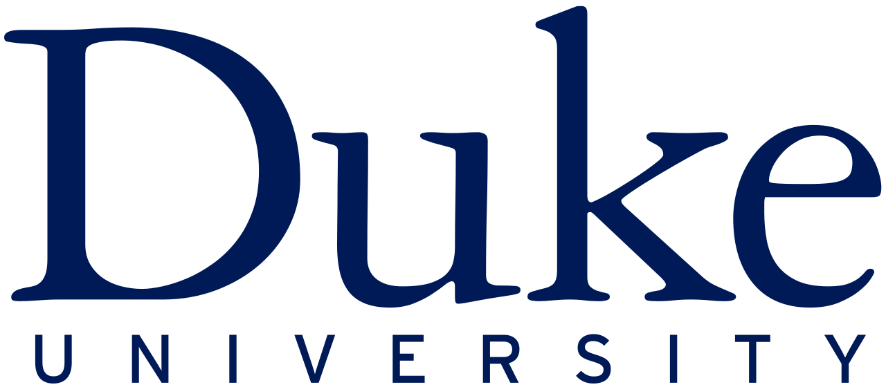

# Data Science Math Skills by Duke University

  

#### Instructor(s) : 
	* Daniel Egger, Executive in Residence and Director, Center for Quantitative Modeling
	* Paul Bendich, Assistant research professor of Mathematics; Associate Director for Curricular Engagement at the Information Initiative at Duke

## About this Course

Data science courses contain math—no avoiding that! This course is designed to teach learners the basic math you will need in order to be successful in almost any data science math course and was created for learners who have basic math skills but may not have taken algebra or pre-calculus. Data Science Math Skills introduces the core math that data science is built upon, with no extra complexity, introducing unfamiliar ideas and math symbols one-at-a-time. 

Learners who complete this course will master the vocabulary, notation, concepts, and algebra rules that all data scientists must know before moving on to more advanced material.

Topics include:
-Set theory, including Venn diagrams
-Properties of the real number line
-Interval notation and algebra with inequalities
-Uses for summation and Sigma notation
-Math on the Cartesian (x,y) plane, slope and distance formulas
-Graphing and describing functions and their inverses on the x-y plane,
-The concept of instantaneous rate of change and tangent lines to a curve
-Exponents, logarithms, and the natural log function.
-Probability theory, including Bayes’ theorem.

While this course is intended as a general introduction to the math skills needed for data science, it can be considered a prerequisite for learners interested in the course, "Mastering Data Analysis in Excel," which is part of the Excel to MySQL Data Science Specialization.  Learners who master Data Science Math Skills will be fully prepared for success with the more advanced math concepts introduced in "Mastering Data Analysis in Excel." 

## Syllabus

### Module 1

#### Welcome to Data Science Math Skills

This short module includes an overview of the course's structure, working process, and information about course certificates, quizzes, video lectures, and other important course details. Make sure to read it right away and refer back to it whenever needed

#### Building Blocks for Problem Solving

This module contains three lessons that are build to basic math vocabulary. The first lesson, "Sets and What They’re Good For," walks you through the basic notions of set theory, including unions, intersections, and cardinality. It also gives a real-world application to medical testing. The second lesson, "The Infinite World of Real Numbers," explains notation we use to discuss intervals on the real number line. The module concludes with the third lesson, "That Jagged S Symbol," where you will learn how to compactly express a long series of additions and use this skill to define statistical quantities like mean and variance.

**Graded:** Graded quiz on Sets, Number Line, Inequalities, Simplification, and Sigma Notation

### Module 2: Functions and Graphs

This module builds vocabulary for graphing functions in the plane. In the first lesson, "Descartes Was Really Smart," you will get to know the Cartesian Plane, measure distance in it, and find the equations of lines. The second lesson introduces the idea of a function as an input-output machine, shows you how to graph functions in the Cartesian Plane, and goes over important vocabulary.

**Graded:** Graded quiz on Cartesian Plane and Types of Function

### Module 3: Measuring Rates of Change

This module begins a very gentle introduction to the calculus concept of the derivative. The first lesson, "This is About the Derivative Stuff," will give basic definitions, work a few examples, and show you how to apply these concepts to the real-world problem of optimization. We then turn to exponents and logarithms, and explain the rules and notation for these math tools. Finally we learn about the rate of change of continuous growth, and the special constant known as “e” that captures this concept in a single number—near 2.718.

**Graded:** Graded quiz on Tangent Lines to Functions, Exponents and Logarithms

### Module 4: Introduction to Probability Theory

This module introduces the vocabulary and notation of probability theory – mathematics for the study of outcomes that are uncertain but have predictable rates of occurrence.

We start with the basic definitions and rules of probability, including the probability of two or more events both occurring, the sum rule and the product rule, and then proceed to Bayes’ Theorem and how it is used in practical problems.

**Graded:** Probability (basic and Intermediate) Graded Quiz

#
## Grading and Assignments

|Course Item|Weightage|Passing Grade|
|:---:|:---:|:---:|
|Week 1 Quiz|25%|75%|
|Week 2 Quiz|25%|75%|
|Week 3 Quiz|25%|75%|
|Week 4 Quiz|25%|80%|

#
#
#### ***Kudos!!!***

Warm Regards, \
Piyush Sambhi \
Email: piyush.sambhi07@icloud.com \
Git URL: https://github.com/sambhipiyush
